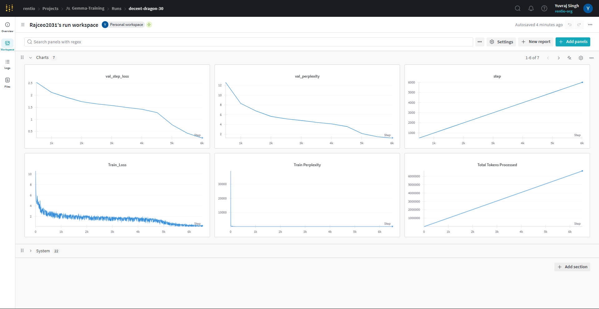

# Llama 4 model in Pytorch from scratch implementation

Trained a small llama scout model (128M) coded and trained from scratch in Pytorch (text only) 

[Llama 4](https://www.llama.com/)

## ModelArgs Hyperparameters

## Model Configuration

| Parameter               | Value                                  | Description                                                      |
|--------------------------|----------------------------------------|------------------------------------------------------------------|
| `block_size`             | 256                                    | Sequence length (number of tokens)                              |
| `batch_size`             | 64                                     | Number of samples processed before model update                 |
| `embeddings_dims`        | 512                                    | Token embedding dimensionality                                  |
| `attn_dropout`           | 0.1                                    | Dropout rate for attention layers                               |
| `no_of_heads`            | 8                                      | Number of attention heads in multi-head attention               |
| `dropout`                | 0.1                                    | Dropout rate for regularization                                 |
| `epochs`                 | 100                                    | Number of training epochs                                       |
| `max_lr`                 | 2.5e-4                                 | Maximum learning rate                                           |
| `no_of_decoder_layers`   | 6                                      | Number of decoder layers                                        |
| `weight_decay_optim`     | 0.1                                    | Optimizer weight decay                                          |
| `beta_1`                 | 0.9                                    | Adam optimizer beta1 parameter                                  |
| `beta_2`                 | 0.95                                   | Adam optimizer beta2 parameter                                  |
| `device`                 | `cuda:0`                               | Device used for training (GPU)                                  |
| `no_kv_heads`            | 2                                      | Number of key/value heads in attention                          |
| `scaling_factor`         | 0.5                                    | Scaling factor for certain operations                           |
| `vocab_size`             | `32768`     | Vocabulary size                                                 |
| `base_freq`              | 10000                                  | Base frequency for rotary embeddings                            |
| `s`                      | 1.0                                    | Scaling factor used elsewhere in the model                      |
| `experts`                | 16                                     | Number of experts in Mixture of Experts (MoE)                   |
| `top_experts`            | 1                                      | Number of top-k experts selected during routing                 |
| `noisy_topk`             | True                                   | Whether to add noise for better expert load balancing           |
| `use_checkpointing`      | False                                  | Whether activation checkpointing is used to save memory         |

### Dataset

[TinyStories](https://huggingface.co/datasets/roneneldan/TinyStories)

### Frameworks:
**Pytorch**

### Epochs/Steps
Steps (train) = 25000

Val iterations = every 500 steps

### Loss Curves

Train loss:  0.22 (last step)

Val loss: 0.235

