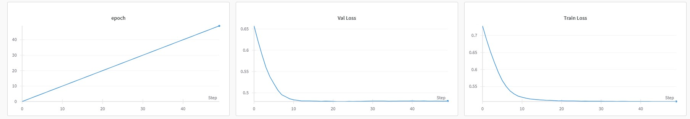

# LSTM in Pytorch from scratch implementation

Trained 128K LSTM model in Pytorch 

## ModelArgs Hyperparameters

| Parameter    | Value    | Description                                                                 
|--------------|----------|-----------------------------------------------------------------------------|
| `batch_size` | 32       | The number of samples processed before the model is updated.                |
| `max_lr`     | 8e-6     | Maximum learning rate.                                                      |
| `dropout`    | 0.2      | Dropout.                                                                    |
| `epochs`     | 50       | Epochs                                                                      |           
| `block_size` | 64       | Weight decay values for the optimizer                                       |

### Frameworks:
**Pytorch**

### Epochs/Steps
Epochs (train) = 50

Val iterations = every epoch

### Losses

Train loss - 0.49 

Val loss - 0.48

### Loss Curves

